# Arkraft System Architecture

> AI 기반 퀀트 리서치 및 포트폴리오 관리 플랫폼 (by Quantit)
>
> 최종 업데이트: 2026-03-03

---

## 1. 시스템 개요

### 1.1 플랫폼 소개

Arkraft는 Quantit에서 개발한 AI 기반 퀀트 리서치 및 포트폴리오 관리 플랫폼이다. Claude Agent SDK를 활용하여 알파 전략 발굴, 리서치 인사이트 생성, 포트폴리오 구성, 금융 리포트 작성 등 퀀트 리서치의 핵심 워크플로우를 자동화한다.

핵심 특징:
- **AI Agent 기반 자동화**: Claude Agent SDK + MCP(Model Context Protocol)를 활용한 4종의 전문 에이전트
- **실시간 스트리밍**: SSE(Server-Sent Events)를 통한 에이전트 작업 진행률 실시간 전달
- **GitOps 기반 인프라**: Terraform + Atlantis, ArgoCD, Argo Workflows 기반의 완전 자동화된 배포
- **멀티 테넌트 인증**: AWS Cognito 기반 OAuth + JWT 인증 체계

### 1.2 레포지토리 맵

| Repository | Stack | Purpose | Port |
|-----------|-------|---------|------|
| `arkraft-api` | Python 3.12, FastAPI, SQLAlchemy 2.0 async | Backend API | 3002 |
| `arkraft-web` | Next.js 16, React 19, TypeScript, pnpm | Frontend | 3000 |
| `arkraft-agent-alpha` | Python 3.14, Claude Agent SDK | Alpha strategy agent (6-phase) | - |
| `arkraft-agent-insight` | Python 3.14, Claude Agent SDK | Research hypothesis agent | - |
| `arkraft-agent-portfolio` | Python 3.14, Claude Agent SDK, MCP | Portfolio construction agent | - |
| `arkraft-agent-report` | Python 3.14, Claude Agent SDK, FastAPI | Financial report agent | 8888 |
| `arkraft-agent-data` | Python 3.14, Claude Agent SDK | RDS Scan & File Sync agent | - |
| `arkraft-deploy` | Helm, ArgoCD, Argo Workflows | K8s deployment charts | - |
| `ai-infra` | Terraform + Atlantis | AWS infra (EKS, RDS, ElastiCache, Istio) | - |
| `alpha-pool-infra` | Terraform + Lambda | DynamoDB -> OpenSearch pipeline | - |

### 1.3 전체 시스템 개요 다이어그램

```mermaid
flowchart TB
    subgraph Users["사용자"]
        Browser["Browser"]
    end

    subgraph Frontend["arkraft-web (Next.js 16)"]
        direction TB
        AppRouter["App Router<br/>(protected)/ + (public)/"]
        BFF["BFF API Routes<br/>~70개 엔드포인트"]
        Domains["12 Domain Modules<br/>auth, builder, session,<br/>alpha-pool, autoresearch,<br/>data-query, data-report,<br/>portfolio-builder,<br/>portfolio-monitor,<br/>signal, trading, community"]
        SharedUI["Shared UI<br/>35 Components + Design System"]
    end

    subgraph Backend["arkraft-api (FastAPI)"]
        direction TB
        Presentation["Presentation Layer<br/>Routes + Middleware"]
        Application["Application Layer<br/>Schemas + Mappers"]
        Infrastructure["Infrastructure Layer<br/>DB, Redis, S3, Auth, SSE"]
        Domain["Domain Layer<br/>Entities + Enums"]
        AgentRunner["Agent Runner<br/>Docker / Argo"]
    end

    subgraph Agents["Agent Services"]
        direction LR
        Alpha["Alpha Agent<br/>6-Phase Discover<br/>3-Phase Optimize"]
        Insight["Insight Agent<br/>Init + Refill"]
        Portfolio["Portfolio Agent<br/>4-Step Pipeline"]
        Report["Report Agent<br/>FastAPI Server<br/>6-Phase Report"]
        DataAgent["Data Agent<br/>scan (5-Phase)<br/>sync (LLM-free)"]
    end

    subgraph MCPServers["MCP Servers"]
        AlphaPool["alpha-pool MCP<br/>(HTTP / Stdio)"]
        PortfolioMCP["portfolio-analysis MCP<br/>(Stdio)"]
        ReportMCPs["Report MCPs<br/>ticker, stock_fundamental,<br/>stock_ai_brief, market_data,<br/>datetime"]
    end

    subgraph AWS["AWS Infrastructure (ap-northeast-2)"]
        direction TB
        EKS["EKS 1.34<br/>Karpenter Autoscaler"]
        RDS["RDS PostgreSQL 17.2<br/>db.t4g.medium"]
        Redis["ElastiCache Redis 7.1<br/>cache.t4g.micro"]
        S3["S3<br/>arkraft.quantit.ai"]
        Cognito["Cognito<br/>User Pool"]
        OpenSearch["OpenSearch Serverless<br/>agent-memory (SEARCH)<br/>arkraft-alpha-pool (VECTORSEARCH)"]
    end

    subgraph DataPipeline["Alpha Pool Pipeline"]
        DynamoDB["DynamoDB<br/>arkraft-alpha-pool"]
        Lambda["Lambda Functions<br/>migrator + indexer"]
        Bedrock["Bedrock<br/>Claude Sonnet + Titan Embeddings"]
        FinterTables["Finter Tables<br/>(DynamoDB Source)"]
    end

    subgraph GitOps["GitOps & CI/CD"]
        ArgoCD["ArgoCD"]
        ArgoWF["Argo Workflows"]
        Atlantis["Atlantis<br/>(ECS Fargate)"]
        GHA["GitHub Actions"]
        ECR["ECR<br/>Container Registry"]
    end

    subgraph External["External Services"]
        Portrader["Portrader GraphQL<br/>crypto + equity"]
        FinterAPI["Finter API"]
        QuandaAgent["Quanda Agent<br/>data query"]
    end

    Browser -->|HTTPS| AppRouter
    AppRouter --> BFF
    AppRouter --> Domains
    Domains --> SharedUI
    BFF -->|Internal API| Presentation
    Browser -->|SSE| Presentation

    Presentation --> Application
    Application --> Infrastructure
    Infrastructure --> Domain
    Infrastructure --> AgentRunner

    AgentRunner -->|Docker Socket / Argo API| Agents
    Alpha --> AlphaPool
    Insight --> AlphaPool
    Portfolio --> AlphaPool
    Portfolio --> PortfolioMCP
    Report --> ReportMCPs

    Infrastructure --> RDS
    Infrastructure --> Redis
    Infrastructure --> S3
    Infrastructure --> Cognito
    Agents --> S3
    Agents --> Redis

    FinterTables --> Lambda
    Lambda --> Bedrock
    Bedrock --> DynamoDB
    DynamoDB --> Lambda
    Lambda --> Bedrock
    Lambda --> OpenSearch
    Lambda --> RDS

    GHA --> ECR
    ArgoCD --> EKS
    ArgoWF --> Agents
    Atlantis --> AWS

    Infrastructure --> Portrader
    Infrastructure --> FinterAPI
    Infrastructure --> QuandaAgent
```

---

## 2. 데이터 플로우

### 2.1 전체 데이터 플로우

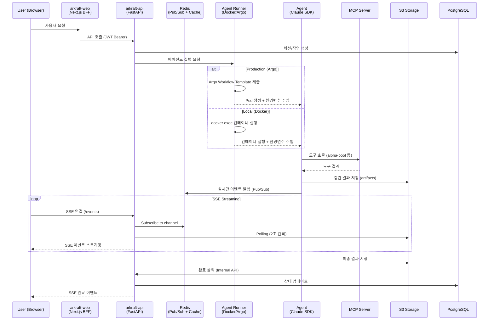

### 2.2 Alpha Discovery 플로우

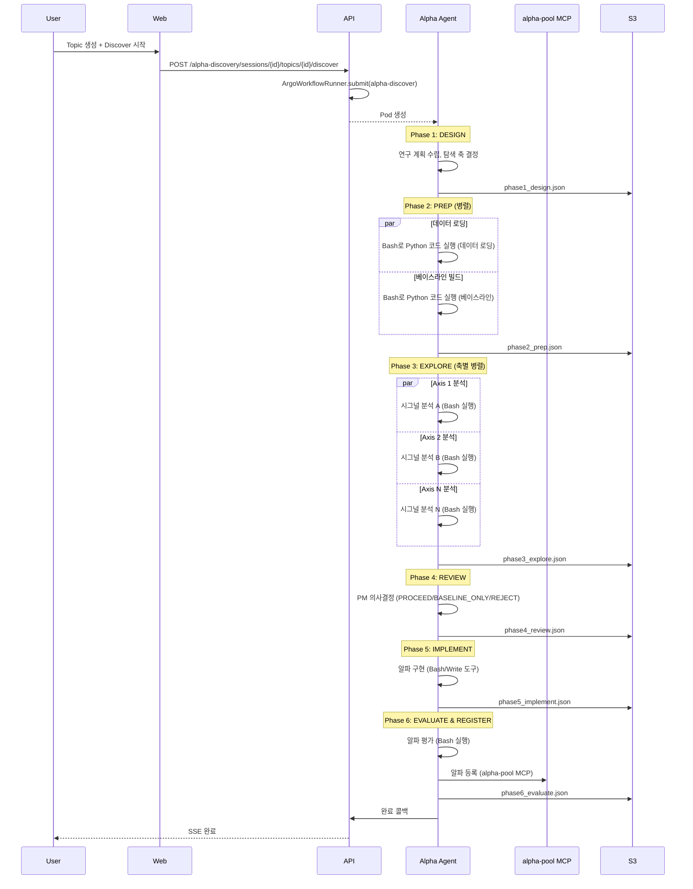

### 2.3 Portfolio Build 플로우

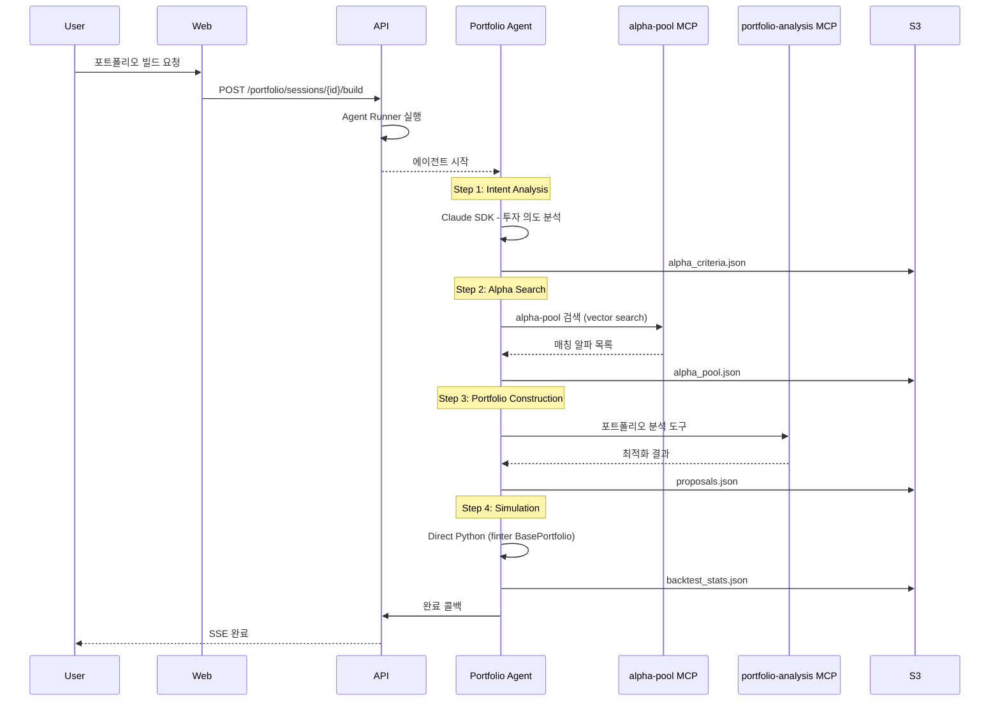

### 2.4 Data Report 플로우

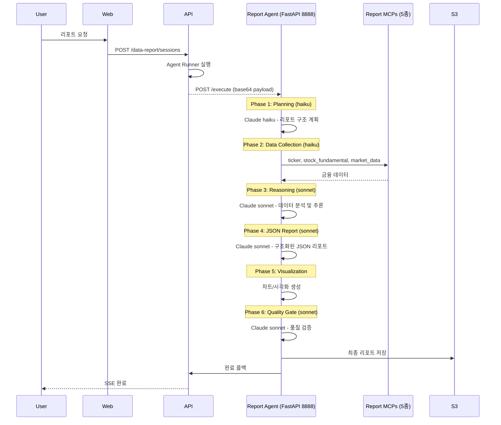

---

## 3. arkraft-api 아키텍처

### 3.1 Clean Architecture 4계층

arkraft-api는 Clean Architecture 원칙을 따르는 4계층 구조로 설계되어 있다. 각 계층은 명확한 책임을 가지며, 의존성은 항상 안쪽(domain)을 향한다.

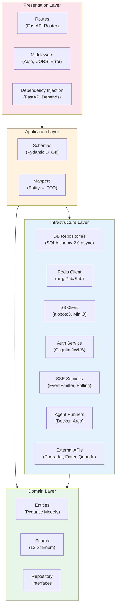

**계층별 책임**:

| 계층 | 경로 | 책임 | 주요 구성 요소 |
|------|------|------|--------------|
| Domain | `domain/` | 비즈니스 엔티티, 열거형, 인터페이스 | Pydantic 모델, 13개 StrEnum, Repository 인터페이스 |
| Application | `application/` | DTO 변환, 비즈니스 로직 조율 | Pydantic Schemas (DTOs), Mappers |
| Infrastructure | `infrastructure/` | 외부 시스템 연동 | DB, Redis, S3, Auth, SSE, Agent Runner |
| Presentation | `presentation/` | HTTP 요청/응답 처리 | FastAPI Routes, Middleware, DI |

### 3.2 DB 스키마

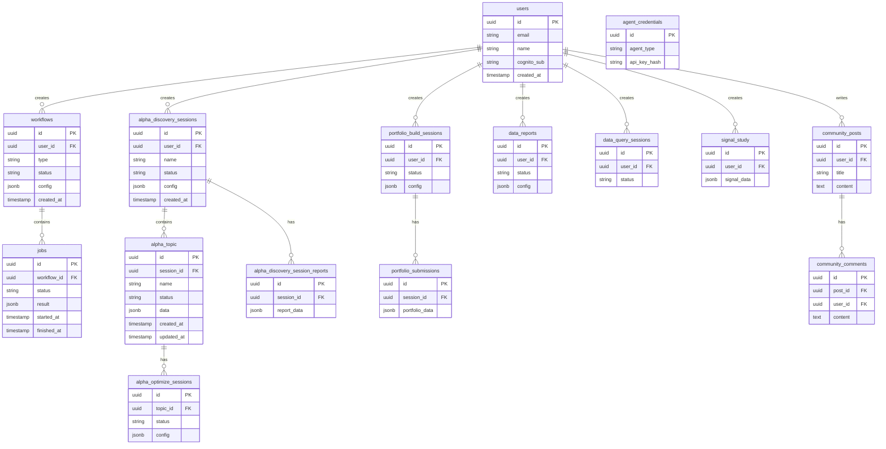

### 3.3 인증 레이어

| Layer | Mechanism | 적용 범위 | 헤더/방식 |
|-------|-----------|----------|----------|
| **Public** | 없음 | Health check, Community 읽기 | - |
| **Internal** | VPC 네트워크 격리만 의존 (헤더 검증 없음) | `/internal/*` 콜백 엔드포인트 | ~~`X-Internal-Secret`~~ (미구현) |
| **Agent** | SHA-256 해시 검증 | Community 쓰기 (에이전트) | `X-Agent-API-Key` |
| **Protected** | Cognito JWT RS256 | 모든 사용자 API | `Authorization: Bearer {token}` |

### 3.4 SSE 스트리밍 패턴

arkraft-api는 3가지 SSE 스트리밍 패턴을 지원한다:

| 패턴 | 사용처 | 데이터 소스 | 특징 |
|------|--------|-----------|------|
| **Builder SSE** | Portfolio Build, Alpha Discover | EventEmitter(asyncio.Queue) + S3 polling | 실시간 이벤트 + 결과 폴링 |
| **Session SSE** | Insight, Alpha Optimize | S3 polling only (2초 간격) | 단순 폴링 기반 |
| **Data Query SSE** | Data Query | S3 history load + Redis Pub/Sub | 과거 로그 + 실시간 구독 |

### 3.5 Agent Runner 듀얼 백엔드

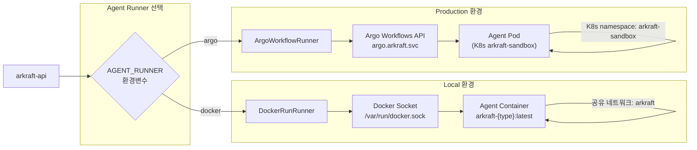

**Argo Workflow Templates**:

| Template | Agent | 용도 |
|----------|-------|------|
| `alpha-discover` | Alpha | 6-Phase Alpha 발굴 |
| `alpha-optimize` | Alpha | 3-Phase Alpha 최적화 |
| `insight-init` | Insight | N개 연구 가설 생성 |
| `insight-refill` | Insight | 1개 인사이트 보충 |
| `portfolio-intent` | Portfolio | 투자 의도 분석 |
| `portfolio-search` | Portfolio | 알파 검색 |
| `portfolio-simulation` | Portfolio | 백테스트 시뮬레이션 |
| `data-scan` | Data | RDS 스캔 (5-Phase: scan→propose→trial→extract→pipeline) |
| `data-sync` | Data | 증분 동기화 (LLM-free, CronWorkflow 실행) |

### 3.6 외부 시스템 연동

| 외부 시스템 | 프로토콜 | 용도 |
|------------|---------|------|
| Argo Workflows | REST API | 에이전트 워크플로우 실행 |
| S3 (aioboto3) | AWS SDK | 결과 저장, MinIO 로컬 지원 |
| AWS Cognito | JWKS RS256 | 사용자 인증, UserInfo Redis 캐싱 |
| Docker Engine | API v1.46 | 로컬 에이전트 컨테이너 관리 |
| Portrader GraphQL | GraphQL | 암호화폐 + 주식 데이터 |
| Finter API | REST | 금융 데이터 |
| Quanda Agent | REST | 데이터 쿼리 에이전트 |

### 3.7 API 응답 포맷

```json
// 단건 성공
{"success": true, "data": {...}}

// 목록 성공 (페이지네이션)
{"success": true, "data": [...], "meta": {"total": 100, "limit": 20, "offset": 0}}

// 실패
{"success": false, "error": "message"}
```

---

## 4. arkraft-web 아키텍처

### 4.1 레이어 구조

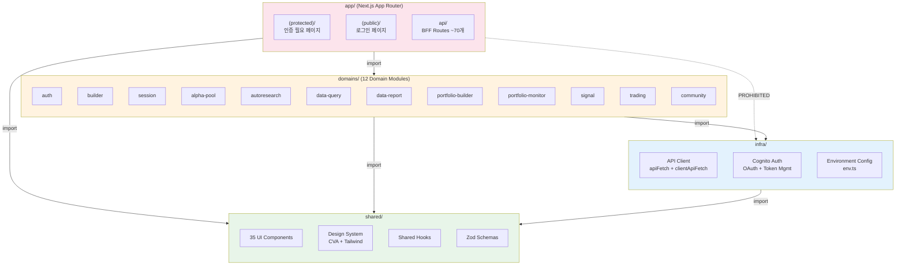

**Import 규칙 (ESLint 강제)**:

| From | Can Import | PROHIBITED |
|------|-----------|------------|
| `app/` | `domains/`, `shared/` | `infra/` 직접 import 금지 |
| `domains/` | `infra/`, `shared/` | - |
| `infra/` | `shared/` only | `app/`, `domains/` |
| `shared/` | `shared/` only | `app/`, `domains/`, `infra/` |

### 4.2 페이지 라우팅 트리

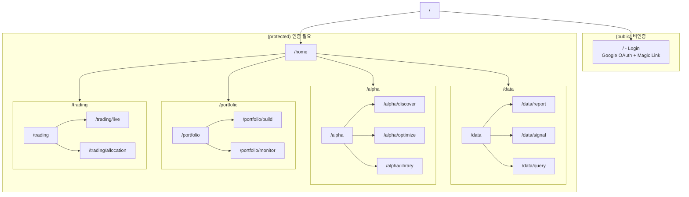

### 4.3 인증 플로우

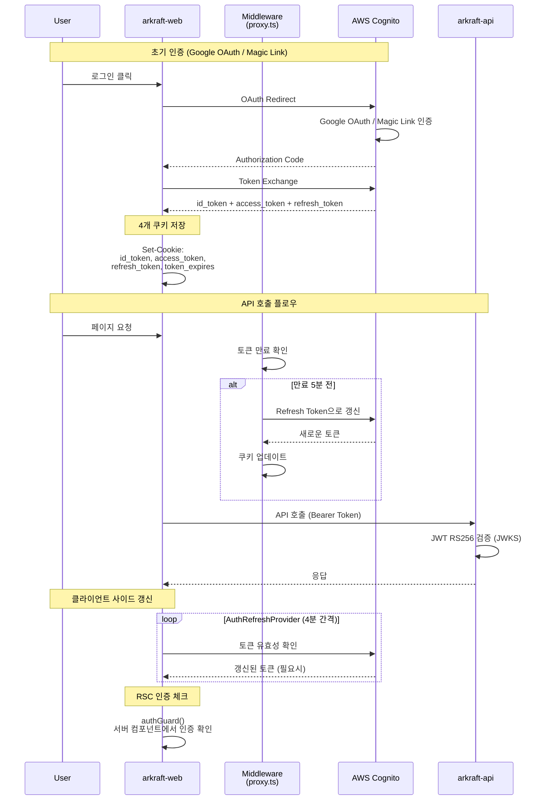

### 4.4 API 클라이언트 이중 구조

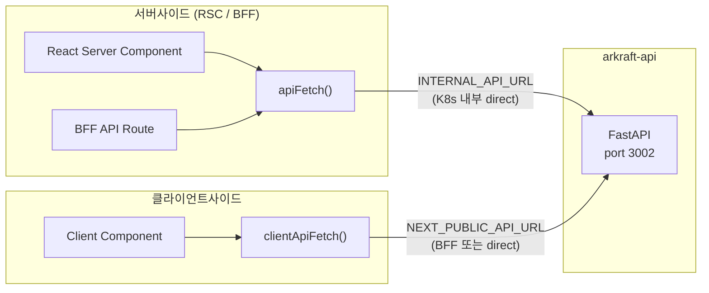

**서버사이드 `apiFetch()`**: K8s 내부 Service Discovery를 통해 직접 호출 (네트워크 홉 최소화)
**클라이언트사이드 `clientApiFetch()`**: 공개 URL을 통해 BFF 또는 직접 API 호출

### 4.5 기술 스택 상세

| 카테고리 | 기술 | 비고 |
|---------|------|------|
| Framework | Next.js 16.1 + React 19 | App Router |
| Compiler | React Compiler | `useMemo`/`useCallback` 사용 금지 |
| Styling | Tailwind CSS 4 + CVA | 컴포넌트 variant 관리 |
| UI Library | Radix UI | Headless 컴포넌트 |
| Charts | ECharts, Recharts, Lightweight Charts | 금융 차트 |
| Animation | framer-motion | 페이지 전환, 컴포넌트 애니메이션 |
| Validation | Zod | 런타임 타입 검증 |
| Toast | sonner | 알림 메시지 |
| Package Manager | pnpm | 의존성 관리 |

---

## 5. Agent 시스템 아키텍처

### 5.1 Agent 공통 구조

모든 에이전트는 동일한 기본 구조를 따른다:

```
src/agent.py         → Claude Agent SDK 옵션 설정
src/main.py          → CLI/서버 진입점
workspace/CLAUDE.md  → Agent 시스템 프롬프트
workspace/.mcp.json  → MCP 서버 설정
```

**공통 패턴**:
- **ClaudeAgentOptions**: `bypassPermissions` 활성화, OAuth token rotation (CLAUDE_OAUTH_TOKEN_1,2,3)
- **Hooks**: PostToolUse (S3 동기화), UserPromptSubmit (세션 캡처)
- **Docker**: `arkraft` 외부 네트워크 공유로 MCP 서버 접근
- **이미지 네이밍**: `arkraft-{agent}:latest`

### 5.2 Alpha Agent 6-Phase Discover 워크플로우

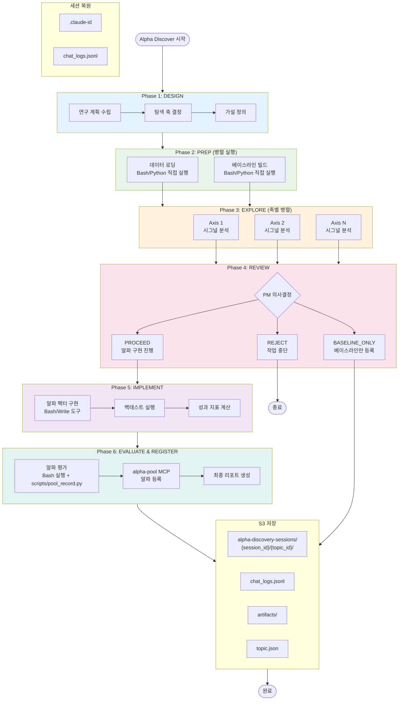

**Alpha Optimize (3-Phase)**:
1. 기존 알파 로드 + 분석
2. 최적화 실행 (파라미터 튜닝)
3. 결과 평가 + 재등록

### 5.3 Insight Agent 워크플로우

| 모드 | 동작 | 출력 |
|------|------|------|
| **Init** | N개 research hypothesis 생성 | `artifacts/insight.json` |
| **Refill** | 1개 insight 보충 생성 | `artifacts/insight.json` (업데이트) |

**특징**:
- MCP: alpha-pool (HTTP 방식)
- AssistantMessage 블록을 insight log 형태로 변환 (text/tool_use/thinking 구분)
- S3 경로: `{session_path}/artifacts/insight.json`

### 5.4 Portfolio Agent 4-Step 파이프라인

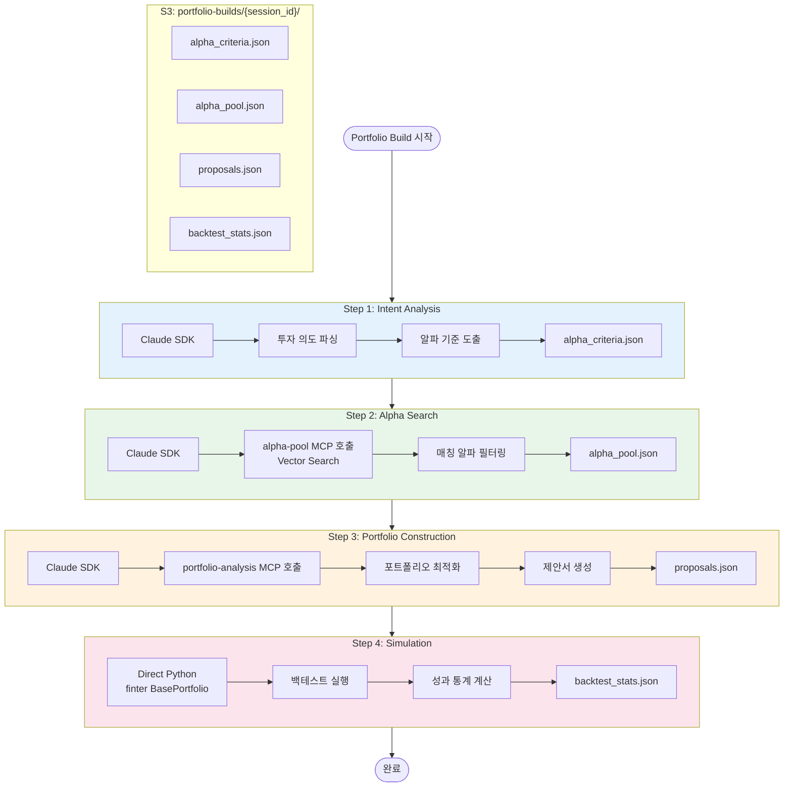

**MCP 방식**: Stdio (로컬 프로세스) - alpha_pool, portfolio_analysis

### 5.5 Report Agent FastAPI 서버 방식

Report Agent는 다른 에이전트와 달리 FastAPI 서버(port 8888) 방식으로 동작한다:

| Phase | 모델 | 역할 |
|-------|------|------|
| 1. Planning | Claude haiku | 리포트 구조 계획 |
| 2. Data Collection | Claude haiku | 금융 데이터 수집 (5개 MCP) |
| 3. Reasoning | Claude sonnet | 데이터 분석 및 추론 |
| 4. JSON Report | Claude sonnet | 구조화된 JSON 리포트 생성 |
| 5. Visualization | - | 차트/시각화 생성 |
| 6. Quality Gate | Claude sonnet | 최종 품질 검증 |

**진입점**: `POST /execute` (base64 payload 수신)
**S3 경로**: `arkraft/users/{email}/requests/{workflow_id}/sessions/{job_id}/`

### 5.6 Agent 비교표

| 항목 | Alpha | Insight | Portfolio | Report | Data |
|------|-------|---------|-----------|--------|------|
| **실행 방식** | Claude Agent SDK | Claude Agent SDK | Claude Agent SDK | FastAPI + Claude SDK | Claude Agent SDK (scan) / Pure Python (sync) |
| **MCP 프로토콜** | HTTP | HTTP | Stdio | HTTP | 없음 |
| **MCP 서버** | alpha-pool | alpha-pool | alpha-pool, portfolio-analysis | ticker, stock_fundamental, stock_ai_brief, market_data, datetime | 없음 |
| **S3 경로** | `alpha-discovery-sessions/{sid}/{tid}/` | `{session}/artifacts/` | `portfolio-builds/{sid}/` | `arkraft/users/{email}/requests/{wid}/sessions/{jid}/` | `teams/{tid}/data_source/{sid}/workspace/` |
| **Hooks** | PostToolUse (S3), UserPromptSubmit | PostToolUse (S3) | PostToolUse (S3) | PostToolUse (S3) | PostToolUse (S3) |
| **세션 복원** | 지원 (.claude-id + chat_logs) | 미지원 | 미지원 | 미지원 | 미지원 |
| **모델 사용** | sonnet (전체) | sonnet (전체) | sonnet (전체) | haiku + sonnet (단계별) | sonnet (scan), 없음 (sync) |
| **파이프라인** | 6-Phase Discover / 3-Phase Optimize | Init / Refill | 4-Step Sequential | 6-Phase Sequential | scan (5-Phase) / sync (LLM-free) |

### 5.7 Claude Agent SDK 실행 구조

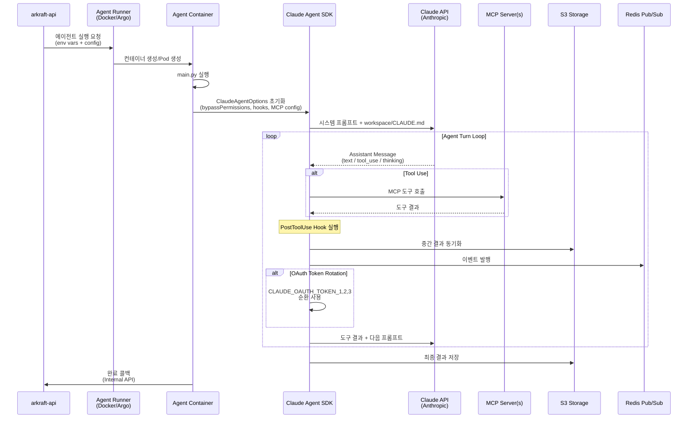

---

## 6. 인프라 아키텍처

### 6.1 AWS 인프라 토폴로지

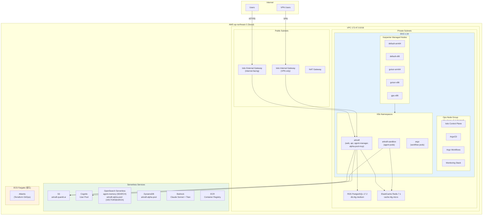

### 6.2 EKS 클러스터 구성

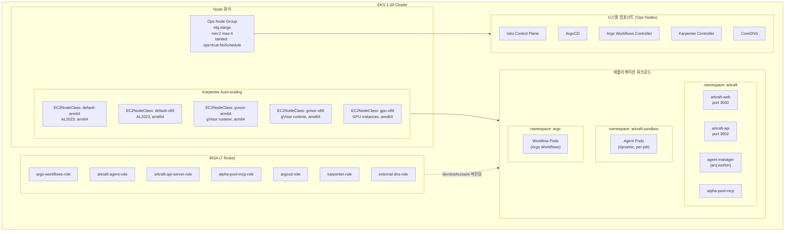

### 6.3 Alpha Pool 데이터 파이프라인

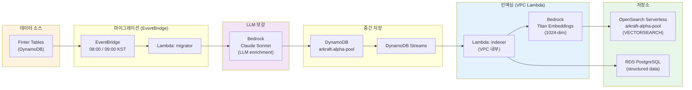

**파이프라인 요약**:
1. Finter DynamoDB 테이블에서 알파 데이터 원본 수집
2. EventBridge가 매일 08:00/09:00 KST에 Lambda migrator 트리거
3. Bedrock Claude Sonnet으로 LLM 기반 메타데이터 보강 (설명, 태그, 분류)
4. arkraft-alpha-pool DynamoDB에 저장
5. DynamoDB Streams가 변경 감지 -> Lambda indexer 트리거
6. Bedrock Titan으로 1024차원 임베딩 벡터 생성
7. OpenSearch Serverless에 벡터 인덱싱 (vector search 지원)
8. RDS PostgreSQL에 구조화된 데이터 저장 (관계형 쿼리 지원)

---

## 7. 배포 및 CI/CD

### 7.1 Argo Workflow Agent 실행 플로우

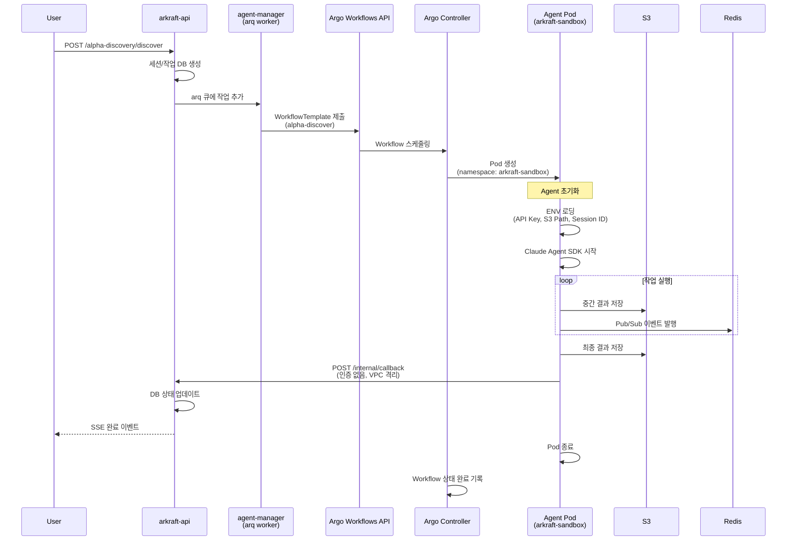

### 7.2 CI/CD 파이프라인

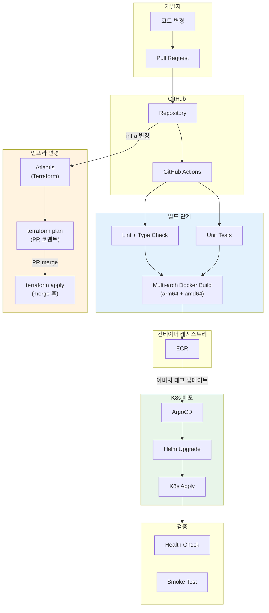

### 7.3 Local vs Production 실행 환경 비교

| 항목 | Local | Production |
|------|-------|-----------|
| **Agent Runner** | `DockerRunRunner` | `ArgoWorkflowRunner` |
| **Agent 실행** | `docker exec` (Docker Socket) | Argo Workflow Template → Pod |
| **네트워크** | `arkraft` Docker 네트워크 (external) | K8s Service Discovery |
| **Namespace** | - (Docker) | `arkraft-sandbox` |
| **S3** | MinIO (로컬) | AWS S3 (`arkraft.quantit.ai`) |
| **DB** | Docker PostgreSQL | RDS PostgreSQL 17.2 |
| **Redis** | Docker Redis | ElastiCache Redis 7.1 |
| **MCP 접근** | Docker 네트워크 내 HTTP/Stdio | K8s 내부 Service / Istio VirtualService |
| **인증** | Cognito (동일) | Cognito (동일) |
| **환경변수** | `.env` 파일 | K8s Secrets + ConfigMap |
| **이미지** | `docker build` 로컬 | ECR (multi-arch) |
| **모니터링** | - | Prometheus + Grafana |

### 7.4 K8s 서비스 구성

**Namespaces**:

| Namespace | 용도 | 주요 워크로드 |
|-----------|------|-------------|
| `arkraft` | 메인 서비스 | web, api, agent-manager, alpha-pool-mcp |
| `arkraft-sandbox` | 에이전트 격리 | agent pods (동적 생성) |
| `argo` | 워크플로우 | Argo Workflows controller + pods |

**Istio VirtualService 라우팅**:

| Host | Gateway | Target | 비고 |
|------|---------|--------|------|
| `arkraft.trade` | External | arkraft-web | 인터넷 공개 |
| `arkraft-api.quantit.ai` | External | arkraft-api | `/internal/*` 경로 차단 |
| `alpha-pool-mcp.quantit.ai` | Internal | alpha-pool-mcp | VPN only |

---

## 8. 보안 및 인증

### 8.1 전체 인증 아키텍처

```mermaid
flowchart TB
    subgraph External["외부 접근"]
        Browser["Browser<br/>(사용자)"]
        AgentContainer["Agent Container"]
        InternalService["내부 서비스<br/>(VPC)"]
    end

    subgraph AuthLayer["인증 계층"]
        subgraph CognitoAuth["Cognito 인증 (Protected)"]
            GoogleOAuth["Google OAuth"]
            MagicLink["Magic Link"]
            CognitoPool["Cognito User Pool"]
            JWT["JWT Token<br/>(RS256, JWKS)"]
        end

        subgraph AgentAuth["Agent 인증"]
            AgentKey["X-Agent-API-Key"]
            SHA256["SHA-256 해시 검증"]
            AgentCreds["agent_credentials 테이블"]
        end

        subgraph InternalAuth["Internal 인증"]
            VPCCheck["VPC 네트워크 격리\n(헤더 검증 없음)"]
        end
    end

    subgraph API["arkraft-api"]
        PublicRoutes["/health, /community (GET)<br/>Public - 인증 없음"]
        ProtectedRoutes["/api/* <br/>Protected - JWT Bearer"]
        AgentRoutes["/community (POST)<br/>Agent - API Key"]
        InternalRoutes["/internal/*<br/>Internal - Secret"]
    end

    Browser -->|"Authorization: Bearer"| JWT
    JWT --> ProtectedRoutes

    Browser -->|"No Auth"| PublicRoutes

    AgentContainer -->|"X-Agent-API-Key"| AgentKey
    AgentKey --> SHA256
    SHA256 --> AgentCreds
    AgentCreds --> AgentRoutes

    InternalService --> VPCCheck
    VPCCheck --> InternalRoutes

    GoogleOAuth --> CognitoPool
    MagicLink --> CognitoPool
    CognitoPool --> JWT
```

### 8.2 IRSA 역할 목록

| IRSA Role | ServiceAccount | 권한 | 적용 Namespace |
|-----------|---------------|------|---------------|
| `argo-workflows-role` | argo-workflows | S3 R/W, ECR pull | argo |
| `arkraft-agent-role` | arkraft-agent | S3 R/W, Bedrock invoke | arkraft-sandbox |
| `arkraft-api-server-role` | arkraft-api | S3 R/W, Cognito, SES | arkraft |
| `alpha-pool-mcp-role` | alpha-pool-mcp | DynamoDB R/W, OpenSearch, RDS | arkraft |
| `argocd-role` | argocd | ECR pull, K8s full | argocd |
| `karpenter-role` | karpenter | EC2 manage, pricing | karpenter |
| `external-dns-role` | external-dns | Route53 manage | kube-system |

### 8.3 네트워크 보안 계층

| 계층 | 메커니즘 | 설명 |
|------|---------|------|
| **Edge** | Istio External Gateway | 인터넷 트래픽 TLS 종료, 도메인 기반 라우팅 |
| **VPN** | Istio Internal Gateway | VPN 전용 서비스 (alpha-pool-mcp, 관리 도구) |
| **Service Mesh** | Istio mTLS | 서비스 간 통신 암호화 |
| **API Gateway** | Istio VirtualService | `/internal/*` 경로 외부 차단 |
| **Pod Security** | gVisor Runtime Class | Agent sandbox에서 gVisor 컨테이너 격리 |
| **IAM** | IRSA | Pod 단위 최소 권한 AWS 접근 |
| **Network Policy** | K8s NetworkPolicy | Namespace 간 트래픽 제어 |
| **Secrets** | K8s Secrets | 민감 정보 암호화 저장 |

---

## 9. 핵심 아키텍처 결정 사항 (ADR)

### ADR-1: Clean Architecture (arkraft-api)

**결정**: 4계층 Clean Architecture 채택 (Domain → Application → Infrastructure → Presentation)
**이유**: 비즈니스 로직과 인프라 의존성의 명확한 분리. 에이전트 러너 백엔드(Docker/Argo) 교체 시 도메인/애플리케이션 계층 변경 불필요. 테스트 용이성 확보.
**트레이드오프**: 초기 보일러플레이트 증가, 작은 기능에도 여러 계층 파일 생성 필요.

### ADR-2: Agent Runner 듀얼 백엔드 (Docker + Argo)

**결정**: 환경변수(`AGENT_RUNNER`)로 Docker/Argo 런타임 선택
**이유**: 로컬 개발 환경에서 Argo 없이 빠른 에이전트 테스트 가능. 프로덕션에서는 Argo Workflows의 스케줄링, 리소스 관리, 재시도 기능 활용.
**트레이드오프**: 두 런타임 모두 유지/테스트해야 하는 부담.

### ADR-3: Claude Agent SDK + MCP 기반 에이전트

**결정**: 각 에이전트를 독립 컨테이너 + Claude Agent SDK + MCP 서버 조합으로 구현
**이유**: 에이전트별 독립 배포/스케일링, MCP를 통한 도구 접근 표준화, Claude의 추론 능력 활용. 세션 복원(Alpha Agent)을 통한 비용 효율적 중단/재개 지원.
**트레이드오프**: Claude API 비용, MCP 서버 관리 오버헤드.

### ADR-4: SSE 3패턴 다중 스트리밍

**결정**: Builder SSE, Session SSE, Data Query SSE 세 가지 패턴 병행
**이유**: 각 유즈케이스별 최적 스트리밍 방식이 다름. Builder는 실시간성 중요(EventEmitter + S3), Session은 폴링만으로 충분, Data Query는 과거 이력 + 실시간 결합 필요.
**트레이드오프**: 스트리밍 코드 복잡도 증가.

### ADR-5: Next.js BFF 패턴

**결정**: Next.js API Routes를 BFF(Backend For Frontend)로 활용, 약 70개 엔드포인트
**이유**: 서버사이드에서 내부 API 직접 호출로 네트워크 홉 최소화. 클라이언트에 민감한 토큰 노출 방지. API 응답 변환/집계를 BFF에서 처리.
**트레이드오프**: BFF 유지 비용, API 변경 시 BFF도 함께 수정 필요.

### ADR-6: Karpenter 기반 멀티 NodeClass

**결정**: 5개 EC2NodeClass (default-arm64/x86, gvisor-arm64/x86, gpu-x86) 운영
**이유**: 워크로드 특성별 최적 인스턴스 유형 선택. arm64로 비용 절감(기본), gVisor로 에이전트 보안 격리, GPU로 ML 워크로드 지원.
**트레이드오프**: NodeClass 관리 복잡도, AMI 업데이트 부담.

### ADR-7: Atlantis를 ECS Fargate에 배치

**결정**: Atlantis를 EKS가 아닌 ECS Fargate에 배포
**이유**: EKS Ops Node Group 업데이트 시 Atlantis가 영향받는 것을 방지. Terraform apply 중 EKS 노드 롤링 업데이트가 발생하면 Atlantis 자체가 중단될 위험이 있음.
**트레이드오프**: ECS Fargate 별도 관리 비용.

### ADR-8: Alpha Pool 데이터 파이프라인 (DynamoDB → OpenSearch)

**결정**: DynamoDB Streams + Lambda + Bedrock 기반 실시간 인덱싱 파이프라인
**이유**: Finter의 알파 데이터를 LLM으로 보강(메타데이터, 태그)하고, 벡터 임베딩으로 시맨틱 검색 지원. Portfolio Agent의 알파 검색 품질 향상.
**트레이드오프**: Bedrock API 비용, Lambda cold start 지연.

### ADR-9: Istio 이중 Gateway

**결정**: External(인터넷) + Internal(VPN only) 두 개의 Istio Gateway 운영
**이유**: 공개 서비스(web, api)와 내부 전용 서비스(alpha-pool-mcp, 관리 도구)의 네트워크 접근 분리. VPN을 통해서만 접근 가능한 서비스로 보안 강화.
**트레이드오프**: Gateway 이중 관리, VPN 의존성.

### ADR-10: Report Agent의 FastAPI 서버 방식

**결정**: Report Agent만 FastAPI 서버(port 8888)로 동작, `POST /execute`로 base64 payload 수신
**이유**: 다른 에이전트(CLI 방식)와 달리, Report Agent는 다단계 모델 전환(haiku → sonnet)과 복잡한 데이터 수집이 필요. HTTP 서버 방식으로 상태 관리와 에러 핸들링이 용이.
**트레이드오프**: 다른 에이전트와 실행 패턴 불일치.

### ADR-11: KMS Envelope Encryption (ARK-944)

**결정**: 외부 DB credentials 암호화 시 AES-GCM 단순화 없이 AWS KMS Envelope Encryption v1 직행. dev bypass 제공(`DATA_SOURCE_KMS_ENABLED=false` → `"dev:" + base64`).
**이유**: 보안 강도 우선. AES-GCM MVP 단계를 생략하여 프로덕션 암호화 표준을 처음부터 적용. dev 환경에서는 bypass로 KMS 없이 빠른 개발 가능.
**트레이드오프**: aioboto3 KMS 의존성 추가, 로컬 개발 시 AWS credentials 필요 (또는 bypass 사용).

### ADR-12: Data Agent의 waiting_input 재개 패턴 (ARK-944)

**결정**: scan 세션 내 Phase 전환 시 기존 DataPipeline waiting_input 패턴 재사용 (S3 `user_answers.json` → Redis pub/sub → agent 재개).
**이유**: 이미 검증된 패턴. scan(Phase 1) → propose(Phase 2) → 사용자 선택 → trial(Phase 3) → extract(Phase 4+5)의 순차적 진행에 동일한 재개 메커니즘 적용하여 코드 재사용성 극대화.
**트레이드오프**: proposals DB SSOT (S3 proposals.json 없음), agent 재개 시 S3에서 user_answers.json 폴링 필요.

### ADR-13: sync 서브커맨드는 LLM 없음 (ARK-944)

**결정**: `sync` CLI 서브커맨드는 Claude Agent SDK를 사용하지 않고 순수 Python으로 구현. extract_recipe.json 기반 증분 쿼리 자동 실행.
**이유**: 정기 동기화는 매번 동일한 로직 반복. LLM 호출 비용 및 불필요한 지연 제거. extract_recipe.json에 쿼리와 last_value가 모두 저장되어 있어 LLM 없이도 완전 자동화 가능.
**트레이드오프**: 스키마 변경 시 자동 적응 불가 → Schema Drift 감지로 보완 (M12).

---

> 이 문서는 Arkraft 플랫폼의 전체 아키텍처를 개괄한다. 각 서브시스템의 상세 구현은 해당 레포지토리의 `CLAUDE.md` 및 코드를 참조할 것.
